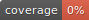

# React boilerplate

[](https://github.com/LizardKing131313/react_boilerplate/actions/workflows/ci.yml)
[](https://github.com/LizardKing131313/react_boilerplate/actions/workflows/qodana_code_quality.yml)


Vite + React + TS (strict), ESLint flat, Prettier, Vitest,
Tailwind, Query, Playwright, pre-commit, Qodana.

## Быстрый старт

```bash
pnpm i
pnpm dlx pre-commit install
make dev
```

## Команды

`make install | dev | build | preview | lint |
typecheck | test | e2e | format | ci`
